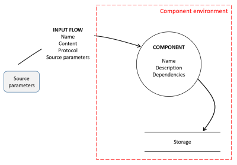
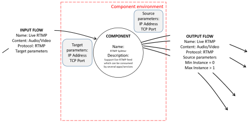

# Introduction
This repository (av-services) contains samples of software components which could be used to create Audio/Video workflows. Most of those components are based on Open Source libraries or tools running in different environments like virtual machines, containers.  
With those Audio/Video components, it's possible to provide services like:
- RTMP to RTSP protcol adaptor 
- RTMP Streamer from a Video file 
- RTMP Receiver into MP4 files on Azure Storage 

## Overview
This chapter describes a list of components which could be used to create an Audio/Video workflow.

##  Audio/Video protocol adaptor client 
The Audio/Video Protocol Adaptor Client will support :
- An Input flow defined with a name, the content (audio only, video only, audio/video), the protocol, the target parameters (udp port, tcp port, ip address,...)
- An Output flow defined with a name, the content (audio only, video only, audio/video), the protocol different from the input protocol, the target parameters (udp port, tcp port, ip address,...)

The Audio/Video Protocol Adaptor Client runs in a specific environment:
- Operating System: Linux, Windows, MacOS
- Docker Container 

##  Audio/Video protocol adaptor server 
The Audio/Video Protocol Adaptor Server will support :
- An Input flow defined with a name, the content (audio only, video only, audio/video), the protocol, the target parameters (udp port, tcp port, ip address,...)
- An Output flow defined with a name, the content (audio only, video only, audio/video), the protocol different from the input protocol, the source parameters (udp port, tcp port, ip address,...)

The Audio/Video Protocol Adaptor Server runs in a specific environment:
- Operating System: Linux, Windows, MacOS
- Docker Container 

##  Audio/Video source server  
The Audio/Video Source Server will support :
- An Output flow defined with a name, the content (audio only, video only, audio/video), the source parameters (udp port, tcp port, ip address,...)

The Audio/Video Source Server runs in a specific environment:
- Operating System: Linux, Windows, MacOS
- Docker Container 

Usually the Source Server use a local file to generate the output flow. It could also be a Tuner.  

##  Audio/Video splitter server  

The Audio/Video Splitter Server will support :
- An Input flow defined with a name, the content (audio only, video only, audio/video), the protocol, the target parameters (udp port, tcp port, ip address,...)
- The Output flows defined with a name, the content (audio only, video only, audio/video), the protocol is the same as the protocol for the input protocol, the source parameters (udp port, tcp port, ip address,...)

You can have several instances of the Output flow to deliver the same Audio/Video stream to several recipients.

The Audio/Video Splitter Server runs in a specific environment:
- Operating System: Linux, Windows, MacOS
- Docker Container 

##  Audio/Video renderer client  
The Audio/Video Renderer Client will support :
- An Input flow defined with a name, the content (audio only, video only, audio/video), the protocol, the source parameters (udp port, tcp port, ip address,...)

This component will render the audio/video content using an hardware device.

The Audio/Video Renderer Client runs in a specific environment:
- Operating System: Linux, Windows, MacOS
- Docker Container 

##  Audio/Video renderer server  
The Audio/Video Renderer Client will support :
- An Input flow defined with a name, the content (audio only, video only, audio/video), the protocol, the target parameters (udp port, tcp port, ip address,...)

This component will render the audio/video content using an hardware device.

The Audio/Video Renderer Server runs in a specific environment:
- Operating System: Linux, Windows, MacOS
- Docker Container 

##  Audio/Video receiver client  
The Audio/Video Renderer Client will support :
- An Input flow defined with a name, the content (audio only, video only, audio/video), the protocol, the source parameters (udp port, tcp port, ip address,...)

This component will capture the incoming audio/video content and store it on a storage device.

The Audio/Video Receiver Client runs in a specific environment:
- Operating System: Linux, Windows, MacOS
- Docker Container 

# Samples of Audio/Video components 

This repository contains samples of Audio/Video services based on Open Source libraries or tools. With those Audio/Video services, it's possible to support scenarios like:
- Audio/Video Gateway: for instance RTMP to RTSP Gateway
- Audio/Video Streamer: for instance RTMP Streamer from Video file 
- Audio/Video Receiver: for instance RTMP Receiver into MP4 files in Azure Storage 

Those Audio/Video services are running in:
- [Azure Virtual Machine](./envs/vm/azure-vm/README.md) 
- [Docker Containers](./envs/container/docker/README.md)
- [Azure IoT Edge](./envs/container/azure-iot-edge/README.md)
  
The following audio/video services are supported:
- Audio/Video Gateway: RTMP ingress/RTMP egress  

- Audio/Video Gateway: RTMP ingress/HLS egress  
 
- Audio/Video Gateway: RTMP ingress/RTSP egress   
 
- Audio/Video Streamer: MP4 file RTMP Source server  
 
- Audio/Video Receiver: RTMP ingress/MP4 files in Azure Storage  
 

# Next Steps

Below a list of possible improvements 

1. Define a common interface to deploy/undeploy, start/stop Audio/Video components
2. Provide Samples of Audio/Video renderer components
3. Provide Samples of Audio/Video splitter components supporting multicast
 
