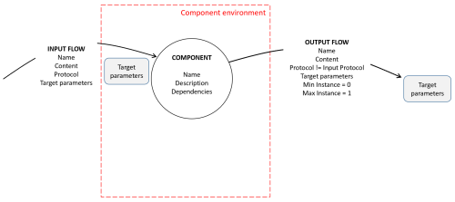
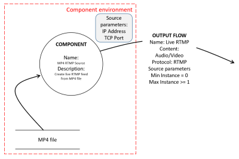

# Audio/Video services (av-services)  

# Table of Contents
- [Introduction](#introduction)
- [Overview](#Overview)
- [Samples of Audio/Video components](#samples-of-audiovideo-components)
- [Using dev container](#using-dev-container)
- [How to install, deploy, test the Audio/Video components with astool.sh](#how-to-install-deploy-test-the-audiovideo-components-with-astoolsh)
- [Next Steps](#next-steps)
 
# Introduction
This repository (av-services) contains samples of software components which could be used to create Audio/Video workflows. Most of those components are based on Open Source libraries or tools running in different environments like virtual machines, containers.  
With those Audio/Video components, it's possible to provide services like:
- RTMP to RTSP protcol adaptor 
- RTMP Streamer from a Video file 
- RTMP Receiver into MP4 files on Azure Storage 

# Overview
This chapter describes a list of components which could be used to create an Audio/Video workflow.

##  Audio/Video protocol adaptor client 
The Audio/Video Protocol Adaptor Client will support :
- An Input flow defined with a name, the content (audio only, video only, audio/video), the protocol, the target parameters (udp port, tcp port, ip address,...)
- An Output flow defined with a name, the content (audio only, video only, audio/video), the protocol different from the input protocol, the target parameters (udp port, tcp port, ip address,...)

The Audio/Video Protocol Adaptor Client runs in a specific environment:
- Operating System: Linux, Windows, MacOS
- Docker Container 



##  Audio/Video protocol adaptor server 
The Audio/Video Protocol Adaptor Server will support :
- An Input flow defined with a name, the content (audio only, video only, audio/video), the protocol, the target parameters (udp port, tcp port, ip address,...)
- An Output flow defined with a name, the content (audio only, video only, audio/video), the protocol different from the input protocol, the source parameters (udp port, tcp port, ip address,...)

The Audio/Video Protocol Adaptor Server runs in a specific environment:
- Operating System: Linux, Windows, MacOS
- Docker Container 


##  Audio/Video source server  
The Audio/Video Source Server will support :
- An Output flow defined with a name, the content (audio only, video only, audio/video), the source parameters (udp port, tcp port, ip address,...)

The Audio/Video Source Server runs in a specific environment:
- Operating System: Linux, Windows, MacOS
- Docker Container 

Usually the Source Server use a local file to generate the output flow. It could also be a Tuner.  


##  Audio/Video splitter server  

The Audio/Video Splitter Server will support :
- An Input flow defined with a name, the content (audio only, video only, audio/video), the protocol, the target parameters (udp port, tcp port, ip address,...)
- The Output flows defined with a name, the content (audio only, video only, audio/video), the protocol is the same as the protocol for the input protocol, the source parameters (udp port, tcp port, ip address,...)

You can have several instances of the Output flow to deliver the same Audio/Video stream to several recipients.

The Audio/Video Splitter Server runs in a specific environment:
- Operating System: Linux, Windows, MacOS
- Docker Container 


##  Audio/Video renderer client  
The Audio/Video Renderer Client will support :
- An Input flow defined with a name, the content (audio only, video only, audio/video), the protocol, the source parameters (udp port, tcp port, ip address,...)

This component will render the audio/video content using an hardware device.

The Audio/Video Renderer Client runs in a specific environment:
- Operating System: Linux, Windows, MacOS
- Docker Container 


##  Audio/Video renderer server  
The Audio/Video Renderer Client will support :
- An Input flow defined with a name, the content (audio only, video only, audio/video), the protocol, the target parameters (udp port, tcp port, ip address,...)

This component will render the audio/video content using an hardware device.

The Audio/Video Renderer Server runs in a specific environment:
- Operating System: Linux, Windows, MacOS
- Docker Container 


##  Audio/Video receiver client  
The Audio/Video Renderer Client will support :
- An Input flow defined with a name, the content (audio only, video only, audio/video), the protocol, the source parameters (udp port, tcp port, ip address,...)

This component will capture the incoming audio/video content and store it on a storage device.

The Audio/Video Receiver Client runs in a specific environment:
- Operating System: Linux, Windows, MacOS
- Docker Container 


# Samples of Audio/Video components 

This repository contains samples of Audio/Video services based on Open Source libraries or tools. With those Audio/Video services, it's possible to support scenarios like:
- Audio/Video Gateway: for instance RTMP to RTSP Gateway
- Audio/Video Streamer: for instance RTMP Streamer from Video file 
- Audio/Video Receiver: for instance RTMP Receiver into MP4 files in Azure Storage 


Those Audio/Video services are running in:
- [Azure Virtual Machine](./envs/vm/azure-vm/README.md) 
- [Docker Containers](./envs/container/docker/README.md)
- [Azure IoT Edge](./envs/container/azure-iot-edge/README.md)
  
The following audio/video services are supported:
- Audio/Video Gateway: RTMP ingress/RTMP egress  

- Audio/Video Gateway: RTMP ingress/HLS egress  
 
- Audio/Video Gateway: RTMP ingress/RTSP egress   
 
- Audio/Video Streamer: MP4 file RTMP Source server  
 
- Audio/Video Receiver: RTMP ingress/MP4 files in Azure Storage  
 

# Using dev container
This av-services repository contains a folder called ".devcontainer". 
When you'll open the project with Visual Studio Code, it will ask you to open the project in container mode provided some pre-requisites are installed on your machine.
## installing pre-requisites
You need to install the following pre-requisite on your machine

1. Install and configure [Docker](https://www.docker.com/get-started) for your operating system.

   - Windows / macOS:

     1. Install [Docker Desktop](https://www.docker.com/products/docker-desktop) for Windows/Mac.

     2. Right-click on the Docker task bar item, select Settings / Preferences and update Resources > File Sharing with any locations your source code is kept. See [tips and tricks](https://code.visualstudio.com/docs/remote/troubleshooting#_container-tips) for troubleshooting.

     3. If you are using WSL 2 on Windows, to enable the [Windows WSL 2 back-end](https://docs.docker.com/docker-for-windows/wsl/): Right-click on the Docker taskbar item and select Settings. Check Use the WSL 2 based engine and verify your distribution is enabled under Resources > WSL Integration.

   - Linux:

     1. Follow the official install [instructions for Docker CE/EE for your distribution](https://docs.docker.com/get-docker/). If you are using Docker Compose, follow the [Docker Compose directions](https://docs.docker.com/compose/install/) as well.

     2. Add your user to the docker group by using a terminal to run: sudo usermod -aG docker $USER

     3. Sign out and back in again so your changes take effect.

2. Install [Visual Studio Code](https://code.visualstudio.com/).

3. Install the [Remote Development extension pack](https://marketplace.visualstudio.com/items?itemName=ms-vscode-remote.vscode-remote-extensionpack)
## Using av-service devcontainer

1. Launch Visual Studio Code in the folder where you stored the av-services repository

    ```bash
        c:\git\av-services> code .
    ```

2. Once Visual Studio Code is launched, you should see the following dialgo box:

    

3. Click on the button 'Reopen in Container'
4. Visual Studio Code will now open the devcontainer. If it's the first time you open the project in container mode, it will first build the container.
5. Once the container is loaded, you can open a new terminal (Terminal -> New Terminal).
6. You have access to the tools installed in the devcontainer like ffmpeg, az client,... You could use this devcontainer to stream video directly towards the virtual machines or containers  in Azure. 

    ```bash
        avuser@d0b2b4ea7293:/avworkspace$ ffmpeg 
    ```

# How to install, deploy, test the Audio/Video components with astool.sh 
In order to easily test those Audio/Video components, each component is delivered with a bash file called avtool.sh which could be used to :
- install the pre-requisites: it could deployed Azure CLI, Docker, ...
- deploy/undeploy  the component: it could deploy a virtual machine, a container,...
- start/stop the component
- get the status of the component (running, exited, ...)
- test the component

In order to use this bash file astool.sh you need an Ubuntu 20.04 LTS machine, sub-system or virtual machine.
The subsequent paragraphs will describe how to use astool.sh.

## Installing the pre-requisites on the host machine
Follow the steps below to install the pre-requities.

1. Ensure git is installed running the following command

```bash
    sudo apt-get install git
```

2. Clone the av-services repository on your machine

```bash
    mkdir $HOME/git
    cd $HOME/git
    git clone https://github.com/flecoqui/av-services.git
    cd av-services/envs/container/docker/av-ffmpeg/alpine 
```
3. Change to a directory containing a avtool.sh file.  
For instance: 

```bash
    cd av-services/envs/container/docker/av-ffmpeg/alpine 
```

3. Run avtool.sh -a install to install the pre-requisite.
For instance: docker 

```bash
    ./avtool.sh -a install
```

## Deploying/Undeploying the av-service 
Once the pre-requisites are installed, you can build and run the av-service component.


1. Run the following command to build and run the container

```bash
    ./avtool.sh -a deploy
```

When you run avtool.sh for the first time, it creates a file called .avtoolconfig to store the av-service  configuration. Each service use its own .avtoolconfig. 
For instance:

```bash
    AV_IMAGE_NAME=av-ffmpeg-alpine
    AV_IMAGE_FOLDER=av-services
    AV_CONTAINER_NAME=av-ffmpeg-alpine-container
    AV_VOLUME=data1
    AV_FFMPEG_COMMAND="ffmpeg -y -nostats -loglevel 0  -i ./camera-300s.mkv -codec copy /data1/camera-300s.mp4"
    AV_TEMPDIR=/tmp/tmp.TblgL0Cm4d
```

If you change to content of file .avtoolconfig, you can change the configuration of the av-service for the next call to avtool.sh.


## Starting/Stopping av-ffmpeg alpine service
Once the av-service is built, you can stop and start the av-service.


1. Run the following command to start the av-service

```bash
    ./avtool.sh -a start
```

2. If the av-service is still running, you can run the following command to stop the av-service 

```bash
    ./avtool.sh -a stop
```

3. You can run the following command to get the status of the av-service 

```bash
    ./avtool.sh -a status
```

## Testing av-ffmpeg alpine service
Once the av-service is built, you can test the av-service .

1. Run the following command to test the container

```bash
    ./avtool.sh -a test
```


# Next Steps

Below a list of possible improvements:  

1. Automate Tests and deployment - to be delivered in March 2021
2. Add a HLS source
3. Add a RTSP source
4. Add components supporting smooth streaming
5. Provide Samples of Audio/Video renderer components
6. Provide Samples of Audio/Video splitter components supporting multicast
 
